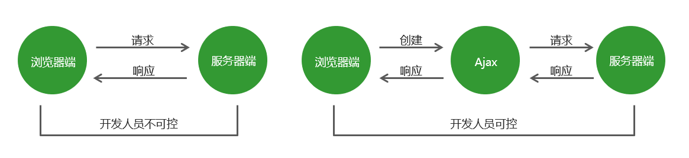

# **01Ajax** 基础


## 1.1**Ajax** 概述

Ajax：标准读音 [ˈeɪˌdʒæks] ，中文音译：阿贾克斯

它是浏览器提供的一套方法，可以实现页面无刷新更新数据，提高用户浏览网站应用的体验。


## 1.2**Ajax** **的应用场景**

-   页面上拉加载更多数据
-   列表数据无刷新分页
-   表单项离开焦点数据验证
-   搜索框提示文字下拉列表


## 1.3.1**Ajax** **运行原理**

Ajax 相当于浏览器发送请求与接收响应的代理人，以实现在不影响用户浏览页面的情况下，局部更新页面数据，从而提高用户体验。




## 1.3.2**Ajax** 的实现步骤

```js
// get
// 1.创建 Ajax 对象
let xhr = new XMLHttpRequest();
// 2.告诉 Ajax 请求地址以及请求方式
xhr.open('get', 'http://www.example.com');
// 3.发送请求
xhr.send();
// 4.获取服务器端给与客户端的响应数据
// 当ajax状态码发生变化的时候出发
xhr.onreadystatechange = function() {
	// 2 请求已经发送了
	// 3 已经接收到服务器端的部分数据了
	// 4 服务器端的响应数据已经接收完成
	console.log(xhr.readyState);
	// 对ajax状态码进行判断 如果状态码的值为4就代表数据已经接收完成了
	if (xhr.readyState === 4) {
        if(xhr.status === 200){
            console.log(xhr.responseText);
        }else{
            console.log('其他情况')
        }
	}
}; 


// post
let xhr = new XMLHttpRequest();
// 拼接请求参数
let nameValue = 'andy';
let ageValue = 18;
let params = 'username='+ nameValue +'&age=' + ageValue;
xhr.open('post', 'http://www.example.com');
// 设置请求参数格式的类型（post请求必须要设置）
xhr.setRequestHeader('Content-Type', 'application/x-www-form-urlencoded');
xhr.send(params);
xhr.onreadystatechange = function() {
	// 2 请求已经发送了
	// 3 已经接收到服务器端的部分数据了
	// 4 服务器端的响应数据已经接收完成
	console.log(xhr.readyState);
	// 对ajax状态码进行判断 如果状态码的值为4就代表数据已经接收完成了
	if (xhr.readyState === 4) {
		console.log(xhr.responseText);
	}
}; 
```


## 1.3.3**服务器端响应的数据格式**

在真实的项目中，服务器端大多数情况下会以 JSON 对象作为响应数据的格式。当客户端拿到响应数据时，要将 JSON 数据和 HTML 字符串进行拼接，然后将拼接的结果展示在页面中。

在 http 请求与响应的过程中，无论是请求参数还是响应内容，如果是对象类型，最终都会被转换为对象字符串进行传输。


## 1.3.4**请求参数传递**

### get请求

```js
xhr.open('get', 'http://www.example.com?name=zhangsan&age=20');
```

### post请求

```js
xhr.setRequestHeader('Content-Type', 'application/json');
let data = JSON.stringify({name: 'akl', age: 18});
xhr.send(data);
```


## 1.3.5**请求报文**

在 HTTP 请求和响应的过程中传递的数据块就叫报文，包括要传送的数据和一些附加信息，这些数据和信息要遵守规定好的格式。


## 1.3.6**请求参数的格式**

```js
//1.application/x-www-form-urlencoded
name=zhangsan&age=20&sex=男

//2.application/json
{name: 'zhangsan', age: '20', sex: '男'}

//在请求头中指定 Content-Type 属性的值是 application/json，告诉服务器端当前请求参数的格式是 json。
//注意：get 请求是不能提交 json 对象数据格式的，传统网站的表单提交也是不支持 json 对象数据格式的
```


## 1.3.7获取服务器端的响应

### 1.**Ajax** **状态码**

在创建ajax对象，配置ajax对象，发送请求，以及接收完服务器端响应数据，这个过程中的每一个步骤都会对应一个数值，这个数值就是ajax状态码。

-   0：请求未初始化(还没有调用open())
-   1：请求已经建立，但是还没有发送(还没有调用send())
-   2：请求已经发送
-   3：请求正在处理中，通常响应中已经有部分数据可以用了
-   4：响应已经完成，可以获取并使用服务器的响应了

```js
xhr.readyState // 获取Ajax状态码
```


### 2.**onreadystatechange** **事件**

当 Ajax 状态码发生变化时将自动触发该事件。

在事件处理函数中可以获取 Ajax 状态码并对其进行判断，当状态码为 4 时就可以通过 xhr.responseText 获取服务器端的响应数据了。

```js
 // 当Ajax状态码发生变化时
 xhr.onreadystatechange = function () {
     // 判断当Ajax状态码为4时
     if (xhr.readyState == 4) {
         // 获取服务器端的响应数据
         console.log(xhr.responseText);
     }
 }

```


### 3.两种获取服务器端响应方式的区别


## 1.3.8**Ajax** **错误处理**

-   1.网络畅通，服务器端能接收到请求，服务器端返回的结果不是预期结果。
-   可以判断服务器端返回的状态码，分别进行处理。xhr.status 获取http状态码
-   2.网络畅通，服务器端没有接收到请求，返回404状态码。
-   检查请求地址是否错误。
-   3.网络畅通，服务器端能接收到请求，服务器端返回500状态码。
-   服务器端错误，告知后端处理  
-   4.网络中断，请求无法发送到服务器端。
-   会触发xhr对象下面的onerror事件，在onerror事件处理函数中对错误进行处理。


## 1.3.9**低版本** IE浏览器的缓存问题

### 问题：

在低版本的 IE 浏览器中，Ajax 请求有严重的缓存问题，即在请求地址不发生变化的情况下，只有第一次请求会真正发送到服务器端，后续的请求都会从浏览器的缓存中获取结果。即使服务器端的数据更新了，客户端依然拿到的是缓存中的旧数据。

### 解决方案：

在请求地址的后面加请求参数，保证每一次请求中的请求参数的值不相同。 

```js
xhr.open('get', 'http://www.example.com?t=' + Date.now());
```


## 1.4.1**Ajax** 异步编程

### 1.同步

-   上一行代码执行完成后，才能执行下一行代码，即代码逐行执行。  

### 2.异步

-   一个人一件事情做了一半，转而去做其他事情，当其他事情做完以后，再回过头来继续做之前未完成的事情。
-   落实到代码上，就是异步代码虽然需要花费时间去执行，但程序不会等待异步代码执行完成后再继续执行后续代码，而是直接执行后续代码，当后续代码执行完成后再回头看异步代码是否返回结果，如果已有返回结果，再调用事先准备好的回调函数处理异步代码执行的结果。

```js
//xhr.open的第三个参数async设置为true时，为异步请求
xhr.open('get', 'http://www.example.com', true);
```


## 1.5Ajax封装

```js
function ajax(options) {
    //创建ajax对象
    let xhr = new XMLHttpRequest();
    //拼接请求参数的变量
    let params = '';
    //循环用户传递进来的对象格式参数
    for (let attr in options.data) {
        //  obj.hasOwnProperty(属性名)判断对象是否拥有该属性，返回一个布尔值
        if (options.data.hasOwnProperty(attr)) {
            params += `${attr}=${options.data[attr]}&`
        }
    }
    console.log(params); //name=andy&age=18&   多了一个&
    //字符串截取 第一个字符 到 字符串长度-1 个字符
    params = params.substr(0, params.length - 1);
    //如果为get请求，改变url
    if (options.type === 'get') {
        options.url += `?${params}`;
    }
    xhr.open(options.type, options.url);

    //如果为post请求
    if (options.type === 'post') {
        xhr.setRequestHeader('Content-Type', 'application/x-www-form-urlencoded');
        xhr.send(params);
    } else {
        xhr.send();
    }

    xhr.onreadystatechange = function () {
        if (xhr.readyState === 4) {
            options.success(xhr.response);
        }
    }
}


//使用
ajax({
    type: 'get',
    data: {
        name: 'andy',
        age: 18
    },
    url: 'http://localhost:3000/first',
    success: res => {
        console.log(res);
    }
})
```

