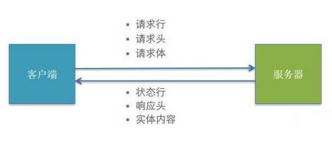

## 1.HTTP 请求交互的基本过程 



-    浏览器端向服务器发送 HTTP 请求(请求报文) 
-    后台服务器接收到请求后, 处理请求, 返回 HTTP 响应(响应报文) 
-    浏览器端接收到响应, 解析显示响应体/调用监视回调 


## 2.HTTP 请求报文 

```js
// 1.请求行， 主要包含method(请求方式) 和 url(请求地址)
// 常见的请求方式有 GET 和 POST


// 2.多个请求头
// 主机地址
Host: www.baidu.com
// cookie
Cookie: BAIDUID=AD3B0FA706E; BIDUPSID=AD3B0FA706;
// 标识请求体类型的请求头
// username=tom&pwd=123 对应 application/x-www-form-urlencoded
// {“name”: 123, "age": 18} json格式对应 application/json
// 文件上传用 multipart/form-data
Content-Type: application/x-www-form-urlencoded 或者 application/json


// 3. 请求体(POST请求且需要传递参数时才有)， 有以下两种格式
username=tom&pwd=123
{"username": "tom", "pwd": 123}
```


## 3.HTTP 响应报文

```js
// 1.响应状态行  status(状态码 如200) statusText(状态文本 如ok)


// 2.多个响应头
Content-Type: text/html;charset=utf-8
Set-Cookie: BD_CK_SAM=1;path=/


// 3.响应体
// html 文本/json 文本/js/css/图片... 
```


## 4. 常见的响应状态码 

```js
200 OK 请求成功。一般用于 GET 与 POST 请求
201 Created 已创建。成功请求并创建了新的资源
401 Unauthorized 未授权/请求要求用户的身份认证
404 Not Found 服务器无法根据客户端的请求找到资源
500 Internal Server Error 服务器内部错误，无法完成请求
```


## 5. 不同类型的请求及其作用 

```js
1. GET: 从服务器端读取数据
2. POST: 向服务器端添加新数据
3. PUT: 更新服务器端已有数据
4. DELETE: 删除服务器端数据
```


## 6. API 的分类 

```js
1. REST API: restful
   (1) 发送请求进行 CRUD 哪个操作由请求方式来决定
   (2) 同一个请求路径可以进行多个操作
   (3) 请求方式会用到 GET/POST/PUT/DELETE

2. 非 REST API: restless
   (1) 请求方式不决定请求的 CRUD 操作
   (2) 一个请求路径只对应一个操作
   (3) 一般只有 GET/POST
```


## 7.使用 json-server 搭建 REST API 

```js
// 1. 安装json-server
npm i -g json-server

// 2.在项目根文件夹创建 db.json 文件
{
  "posts": [
    { "id": 1, "title": "json-server1", "author": "typicode1" },
    { "id": 2, "title": "json-server2", "author": "typicode2" }
  ],
  "comments": [
    { "id": 1, "body": "some comment", "postId": 1 }
  ],
  "profile": { "name": "typicode" }
}

// 3.启动   json-server --watch db.json
// 访问 localhost:3000/posts可以得到对应的数据
```


```js
// 以上面的db.json为例

// 读取 posts 对应的数据
axios.get('http://localhost:3000/posts').then(res=>{
    console.log(res.data)
})

// 读取 posts 对应的数据中 id=1 的数据
axios.get('http://localhost:3000/posts', {
    params: {
        id: 1
    }
}).then(res=>{
    console.log(res.data)
})

// 向 posts 添加新数据，使用post方式发送请求
axios.post('http://localhost:3000/posts', {
    id: 3,
    title: 'json-serer3',
    author: 'typicode3'
}).then(res=>{
    console.log(res.data)
})

// 修改 posts 中 id=3 的数据， 使用put方式发送请求
axios.put('http://localhost:3000/posts/3', {
    title: 'json-server3',
    author: 'typicode3'
}).then(res=>{
    console.log(res.data)
})

// 删除 posts 中 id=3 的数据， 使用delete方式啊送货请求
axios.delete('http://localhost:3000/posts/3').then(res=>{
    console.log(res.data)
})
```


