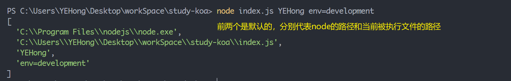

## 1.`Node`程序传递参数

假如当前有一个 `index.js`文件，我们可以通过 `node index.js`来执行这个文件。如果我们需要这个文件在不同的情况下产生不同的结果，我们就需要给它传递参数。

```js
// 传递参数的方式很简单，只需要在执行命令后追加想要传递的参数即可
node index.js YEHong env=development
// 那么如何在代码中获取这些参数呢？答案是Node的内置对象 process
console.log(process.argv);
```




## 2.`Node`中的全局对象

- `__dirname`：获取当前文件的路径
- `__filename`：获取当前文件的路径和文件名称
- `process`：process提供了Node进程中相关的信息
- `console`：提供了简单的调试控制台
- 定时器函数
- `exports、module、require()、Buffer`

### `global`对象

`global`是一个全局对象，事实上前端我们提到的`process、console、setTimeout`等都有被放到`global`中。它和 `window`的区别在于，`window`只存在于浏览器中。


## 3.内置模块 `path`

我们知道，在 `Mac、Linux、Window`这些不同的操作系统中，文件路径的拼接方式是不一样的。`Path`模块就是用于对路径拼接进行处理的，不需要开发者去根据系统环境来进行不同的路径拼接工作。

```js
// 常用 Api
const path = require("path");

const currentPath = `C:\\Users\\YEHong\\Desktop\\workSpace\\study-koa\\index.js`;
// 获取文件夹
console.log(path.dirname(currentPath)); // C:\Users\YEHong\Desktop\workSpace\study-koa
// 获取文件名
console.log(path.basename(currentPath)); // index.js
// 获取文件扩展名
console.log(path.extname(currentPath)); // .js

// 路径拼接
const prePath = `C:\\Users\\YEHong\\Desktop\\workSpace\\study-koa`;
const filePath = './index.js';
// resolve 可以识别相对路径
console.log(path.resolve(prePath, filePath)); // C:\Users\YEHong\Desktop\workSpace\study-koa\index.js


// path还有一个 join 方法，用来将多个字符串拼接成路径字符串，
// 和 resolve的区别在于，resolve是以应用程序为根目录，path.resolve()和__dirname的返回结果是一样的

```


## 4.内置模块 `fs`

`fs`是`File System`的缩写，表示文件系统。

### 获取文件信息（文件大小、尺寸等信息）

```js
// 一般都有同步和异步的方法，这里只展示异步的写法
const fs = require("fs");
// 文件路径
const filePath = "./src/assets/index.txt";

const getFileInfo = async () => {
  try {
    const info = await fs.promises.stat(filePath);
    console.log(info);
  } catch (err) {
    console.log(err);
  }
};

getFileInfo();

```


### 文件的读写

`fs.readFile(path[, options], callback)`  					读取文件的内容
`fs.writeFile(file, data[, options], callback)`		 在文件中写入内容, `data`是写入内容

`options`参数是一个对象，包含两个参数：`flag`(写入方式)  和 `encoding`(字符编码)

`flag`的值主要有以下几种：

- w 打开文件写入（用新内容来覆盖旧内容），默认值；
- w+打开文件进行读写，如果不存在则创建文件；
- r+ 打开文件进行读写，如果不存在那么抛出异常；
- r打开文件读取，读取时的默认值；
- a打开要写入的文件，将流放在文件末尾。如果不存在则创建文件；
- a+打开文件以进行读写，将流放在文件末尾。如果不存在则创建文件

`encoding`在文件读取时不设置为 `utf-8`，则返回的结果是`Buffer`

```js
// 文件读取
const fs = require("fs");

const filePath = "./src/assets/index.txt";
fs.readFile(filePath, { encoding: "utf-8" }, (err, data) => {
  if (err) {
    console.log("err", err);
    return;
  }
  console.log(data);
});

```

```js
// 文件写入
const fs = require("fs");

const filePath = "./src/assets/index.txt";
const content = "Today is sunday!";

fs.writeFile(filePath, content, { flag: "a+" }, (err) => {
  if (err) {
    console.log("err", err);
    return;
  }
  console.log("success");
});

```


### 文件夹的操作

```js
1.创建文件夹
const fs = require("fs");

const dirname = "./src/assets/icon";
// 1.判断文件夹是否已存在 fs.existsSync(dirname) 返回值为布尔值
if (!fs.existsSync(dirname)) {
  // 2.不存在则创建 异步和同步写法
  // fs.mkdir(dirname, (err) => {
  //   console.log(err);
  // });
  fs.mkdirSync(dirname);
}
```

```js
2.读取文件夹中的所有文件
const fs = require("fs");
const path = require("path");

const dirname = "./src/assets";
fs.readdir(dirname, (err, files) => {
  // 获取到一个字符串数组 [ 'a.js', 'icon', 'index.txt' ]
  console.log(files);
});

// 上面的返回结果中 icon 是另一个文件夹，如果我们需要获取的结果中也包含icon文件夹下的所有文件，就需要使用递归
function getFiles(dirname) {
  // withFileTypes 设置为true后返回的结果不再是字符串数组，而是file对象数组
  fs.readdir(dirname, { withFileTypes: true }, (err, files) => {
    for (let file of files) {
      // 判断是否是文件夹
      if (file.isDirectory()) {
        const filepath = path.resolve(dirname, file.name);
        getFiles(filepath);
      } else {
        console.log(file.name);
      }
    }
  });
}

getFiles(dirname);

```

```js
3.文件重命名
fs.rename("./why", "./kobe", err => {
  console.log(err);
})
```


## 5.内置模块 `events`

用于发出事件和监听事件，可以给不同模块做信息传递的桥梁

```js
1.基本使用
const EventEmiter = require("events");

const emitter = new EventEmiter();
// 事件监听 emitter.on(eventName, listener)
emitter.on("event1", (...args) => {
  console.log("event1 被触发", args);
});

setTimeout(() => {
  // 事件触发 emitter.emit(eventName[, ...args])
  emitter.emit("event1", "阿卡丽", 18);
  // 事件解绑 emitter.off(eventName, listener)
  emitter.off("event1");
}, 3000);
```

```js
2.其它方法
// 返回当前 EventEmitter 对象注册的事件字符串数组
const eventList = eventBus.eventNames();
console.log(eventList);

// 事件只监听一次
emitter.once(eventName, listener)

// 移除所有的监听器, 不传参数移除所有，传参数则移除对应的事件名的监听
emitter.removeAllListeners([eventName])
```


