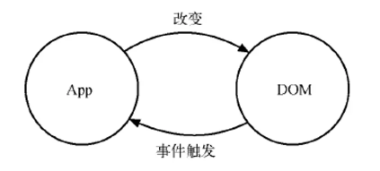
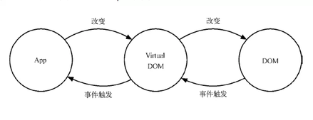

## 1.1 React简介

### 一、React的起源和发展

>    React 起源于 Facebook 的内部项目，因为该公司对市场上所有 JavaScript MVC 框架，都不满意，就决定自己写一套，用来架设Instagram 的网站。做出来以后，发现这套东西很好用，就在2013年5月开源了 

补充一下为什么虚拟DOM框架越来越流行：

-   原生js操作DOM繁琐、且效率低
-   js直接操作DOM会导致大量的重绘、重排，比较消耗性能
-   原生js没有组件化概念，代码复用率低（ 模块化只能复用js，无法复用HTML和css ）


### 二、React与传统MVC的关系

>   轻量级的视图层库！A JavaScript library for building user interfaces
>
>   React不是一个完整的MVC框架，最多可以认为是MVC中的V（View），甚至React并不非常认可MVC开发模式；React 构建页面 UI 的库。可以简单地理解为，React 将界面分成了各个独立的小块，每一个块就是组件，这些组件之间可以组合、嵌套，就成了我们的页面。


### 三、React 衍生

-   React JS
-   React Native (RN)
-   React VR


### 四、React 特点

-   **声明式设计** - 采用声明范式，可以轻松描述应用
-   **高效** - 通过对DOM的模拟，最大限度的减少与DOM的交互
-   **灵活** - 可以与已知的库或框架很好的配合
-   **JSX** - 使用JSX语法来描述DOM结构
-   **组件** - 通过构建组件，使得代码更加容易得到复用，能够很好的应用在大项目的开发中。
-   **单向数据流** - React 实现了单向响应的数据流，从而减少了重复代码，这也是它为什么比传统数据绑定更简单。


### 五、**React高性能的体现 - 虚拟DOM**

>   在Web开发中我们总需要将变化的数据实时反应到UI上，这时就需要对DOM进行操作。而复杂或频繁的DOM操作通常是性能瓶颈产生的原因。（***重绘与回流***）
>
>   React为此引入了虚拟DOM（Virtual DOM）的机制：在浏览器端用Javascript实现了一套DOM API。基于React进行开发时所有的DOM构造都是通过虚拟DOM进行，每当数据变化时，React都会重新构建整个DOM树，然后React将当前整个DOM树和上一次的DOM树进行对比，得到DOM结构的区别，然后仅仅将需要变化的部分进行实际的浏览器DOM更新。而且React能够批处理虚拟DOM的刷新，在一个事件循环（Event Loop）内的两次数据变化会被合并，例如你连续的先将节点内容从A-B,B-A，React会认为A变成B，然后又从B变成A  UI不发生任何变化，而如果通过手动控制，这种逻辑通常是极其复杂的。
>
>   尽管每一次都需要构造完整的虚拟DOM树，但是因为虚拟DOM是内存数据，性能是极高的，故而对实际DOM进行操作的仅仅是Diff部分，因而能达到提高性能的目的。这样，在保证性能的同时，开发者将不再需要关注某个数据的变化如何更新到一个或多个具体的DOM元素，而只需要关心在任意一个数据状态下，整个界面是如何Render的。


#### 1. 传统DOM操作示意图




#### 2. 虚拟DOM操作示意图




## 1.2 ReactAPI

```js
// 1.创建react元素
// 参数1 元素名称
// 参数2 元素属性
// 第三个及以后的参数都为元素的子节点
// 需要安装react npm i react
let title = React.createElement('h1', {id: 'title'}, 'hello react');

// createElement()的问题
// 1.繁琐不简洁	2.不直观，不能一眼看出描述的结构

// 2.渲染react元素
// 参数1 要渲染的react元素
// 参数2 挂载点
// 需要安装 react-dom  npm i react-dom
ReactDom.render(title, document.getElementById('root'));
```


## 2.1 React脚手架

```js
//安装脚手架
npm i --g create-react-app

//创建项目
npm create-react-app 项目名
//如果create-react-app 为局部安装使用npx
npx create-react-app 项目名

//启动项目
npm start
//打包项目
npm run build
//解除 webpack 的封印（默认是看不到webpack配置的）
npm run eject
```


## 3.1 JSX

### JSX 的由来

>   React 为了方便 View 层组件化。承载了构建 HTML 结构化页面的职责。从这点上来看，React 与其他 JavaScript 模板语言有着许多异曲同工之处，但不同之处在于 React 是通过创建与更新虚拟元素（virtual element）来管理整个 Virtual DOM 的。
>
>   JSX 将 HTML 语法直接加入到 JavaScript 代码中，再通过翻译器转换成 **纯JavaScript** 。在实际开发中，JSX 在产品打包阶段都已经编译成 纯JavaScript 了，不会带来副作用，反而让代码更加直观并易于维护。
>
>   JSX 的官方定义是 **类XML语法的ECMAScript扩展**。它完美地利用了 JavaScript 自带的语法和特性。并使用大家熟悉的HTML语法来创建虚拟元素。

### JSX 的构成

-   javascript
-   xml

### JSX 的特征

1.只有一个根标签

```jsx
// 如果不希望根标签被渲染，可以使用Fragment来作为根标签
import React, {Component, Fragment} from 'react';

export default class App extends Component {
    constructor(props) {
        super(props);
        this.state = {};
    }

    render() {
        return (
            <Fragment>
                <p>Hello World</p>
                <p>App Component</p>
            </Fragment>
        )
    }
}
```

2.单标签必须闭合，如 <input type='text' />	

3.img 标签必须包含 alt 属性

4.普通标签都是小写子母，组件标签首字母大写

5.标签的类名属性不是 class 而是 className

6.label 标签和 input 标签的绑定不是 for 而是  htmlFor

```jsx
<label htmlFor='userName'>
	<input id='userName' type='text' />
</label>
```

7.style 需要写成对象的形式

```jsx
// { color: 'red', fontSize: '60px' } 是style的写法，外面还有一层{}表示这是一个表达式
//在react中插值表达式为{} Vue中的插值表达式则为{{}}
const element = <h1 style={{ color: 'red', fontSize: '60px' }}>Hello, Josh Perez</h1>;

ReactDOM.render(
  element,
  document.getElementById('root')
);
```

8.表达式采用单括号，而非vue的双括号

9.不使用转义

>    React DOM 在渲染所有输入内容之前，默认会进行转义。它可以确保在你的应用中，永远不会注入那些并非自己明确编写的内容。所有的内容在渲染之前都被转换成了字符串。这样可以有效地防止 XSS（cross-site-scripting, 跨站脚本）攻击。 

```jsx
//如果不希望转义的话，需要使用 dangerouslySetInnerHTML 属性
const name = '<p>Josh Perez</p>';
const element = (
  <h1>
    Hello, 
    <div dangerouslySetInnerHTML={{__html: name}}></div>
  </h1>
);

ReactDOM.render(
  element,
  document.getElementById('root')
);
```

10.JSX其实是  **React.createElement()** 的语法糖，所以在React中凡是使用JSX语法的文件都需要在文件开头引入React

11.false、true、undefined、null都是合法的子元素，但它们都并不会被渲染。利用这个特性，可以通过三元运算符来控制是否显示对应组件

```jsx
//当flag为true时渲染 <Swiper/> 组件, 为false时什么都不渲染
{
    flag ? <Swiper/> : false
}
```


## 4.1元素

>    元素是构成 React 应用的最小砖块。 
>
>    组件是由元素构成的。 

```jsx
const element = <h1>Hello, world</h1>;
```

与浏览器的DOM元素不同，React元素是创建开销极小的普通对象。React DOM会负责更新DOM来与React元素保持一致


## 5.1 组件与props

### 一、组件

>    组件可以将UI切分成一些独立的、可复用的部件，这样你就只需专注于构建每一个单独的部件 

1.  组件从概念上看就像是函数，它可以接收任意的输入值（称之为“props”），并返回一个需要在页面上展示的React元素

2.  React 组件没有全局组件的概念，需要使用某个组件的文件，都需要在当前文件定义好或者从其它文件中引入

3.  React 组件首字母大写

    

### 组件的两种定义方式

1.函数式组件

```jsx
import React from 'react';
const Welcome = (props) => {
  return <h1>Hello, {props.name}</h1>;
}
```

2.类组件

```jsx
impoet React from 'react';
class Welcome extends React.Component{
    render(){
        return <h1>Hello,{this.props.name}</h1>
    }
}
```


### 组件的使用

```jsx
ReactDOM.render(
  <div>
    <Component1 />
    <Component2 />
  </div>,
  document.getElementById('root')
);
```


### 组件嵌套

```jsx
// com1.js
class Com1 extends Component {
  render() {
    return (
      <div>我是 com1 组件</div>
    )
  }
}

// com2.js
import Com1 from './com1.js';
class Com2 extends Component {
  render() {
    return (
      <div>
        <h1>我是 com2 组件</h1>

        <Com1 />
      </div>
    )
  }
}
```


### 二、Props

>   当React遇到的元素是用户自定义的组件，它会将JSX属性作为单个对象传递给该组件，这个对象称之为Props。Props中的每一项称之为一个prop 

### Props的特点

1.  props 是只读的。不允许修改。 

2.  props可以接受任意类型的值

3.  使用类组件时，如果写了构造函数，应该将 props 传递给 super() ,否则无法在构造函数中获得props

    ```jsx
    import React, {Component} from 'react';
    
    export default class App extends Component {
        constructor() {
            super();
            console.log(this.props); // undefined
        }
    
        render() {
            return (
                <h1>Hello world</h1>
            )
        }
    }
    ```


### Props 的类型校验 

文档：https://react.docschina.org/docs/typechecking-with-proptypes.html

1.需要安装 prop-types 模块

2.定义组件的 **propTypes** 属性

```jsx
import PropTypes from 'prop-types';

//类组件
class Welcome extends React.Component {
  render() {
    return <h1>Hello, {this.props.name}</h1>;
  }
}

Welcome.propTypes = {
  name: PropTypes.string
}

// 函数组件
const Hello = (props) => <h1>hello, { props.name }</h1>

Hello.propTypes = {
  name: PropTypes.number
}
```


### props的默认值

定义组件的 **defaultProps** 属性

```jsx
// 类组件
class Welcome extends React.Component {
  render() {
    return <h1>Hello, {this.props.name}</h1>;
  }
}

Welcome.defaultProps = {
  name: '张三'
}

// 函数组件
const Hello = (props) => <h1>hello, { props.name }</h1>
Hello.defaultProps = {
  name: 2
}
```


## 6.1 state

>    state 与 props 类似，但是 state 是私有的，并且完全受控于当前组件。 

### 初始化、使用与更新

```jsx
class Hello extends React.Component {
  constructor(props) {
    super(props);

    // 定义状态
    this.state = {
      name: "hello"
    };
  }

  render() {
    return (
      <div>
        {/* 通过 this.state.xxx 使用状态 */}
        <h1>hello, {this.state.name}</h1>
      
        {/* 通过调用 this.setState() 来更新状态 */}
        <button
          onClick={() => {
            this.setState({ name: "world" });
          }}
        >
          修改name
        </button>
      </div>
    );
  }
}
```


### 正确的使用 State

  1.不能直接通过this.state.xx = xx 来改变数据

2.  State 的更新可能是异步的

    ```jsx
    // 在一般情况下，setState时异步的
    // 点击前count值为0
    handleClick = ()=>{
        this.setState({
            count: this.state.count + 1
        }, ()=>{
            console.log('callback', this.state.count) // count为1
        });
        console.log(this.state.count); // count为0，此处setState为异步
    };
    
    
    // 在setTimeout中， setState时同步的
    handleClick = ()=>{
        setTimeout(()=>{
            this.setState({
                count: this.state.count + 1
            });
            console.log(this.state.count); // count值为1， 此处setState为同步
        }, 0)
    };
    
    
    // 自己定义的Dom事件中，setState是同步的
    componentDidMount() {
        document.addEventListener('click', ()=>{
            this.setState({
                count: this.state.count + 1
            });
            console.log(this.state.count) // count值为1， 此处setState为同步
        })
    }
    ```

3.  State 的更新会被合并 

    ```jsx
    // 传入对象，会被合并。下面的结果为 count + 1
    // 因为setState在这种情况下为异步， 所以在第一次setState后，
    // this.staet.count还是+1之前的值，后面执行多少次结果都一样
    this.setState({
        count: this.setState.count + 1
    })
    
    this.setState({
        count: this.setState.count + 1
    })
    
    this.setState({
        count: this.setState.count + 1
    })
    
    
    // 传入函数不会被合并, 下面的结果为count + 3
    this.setState((preState, props)=>{
        return {
            count: prestate.count + 1
        }
    })
    
    this.setState((preState, props)=>{
        return {
            count: prestate.count + 1
        }
    })
    
    this.setState((preState, props)=>{
        return {
            count: prestate.count + 1
        }
    })
    ```

    

1.  普通情况下只能在 constructor 构造函数中初始化 state。(考查: 实验性的 public class fields 语法)
2.  constructor 构造函数 必须在函数第一行调用 super() 来调用父类的构造函数，不然 this 指针会出问题。
3.  通过 this.state.xxx 来使用某个状态。
4.  通过 this.setState() 来更新状态。
5.  state 或 props 的变化，会引起组件的重新 render 。

-   对类组件来说，就是类的 render 函数重新执行
-   对函数式组件来说，这个函数重新执行


## 7.1 事件处理函数的this指向问题

### 区分普通函数与事件处理函数

1.  普通函数是直接调用的。不存在 this 指向问题，谁调用的，this 指向就是谁。
2.  普通函数没有事件对象 event
3.  事件处理函数其实也是一个函数，只是他绑定在某个事件上。
4.  事件处理函数的 this 默认指向 undefined

### 解决this指向问题的4种办法

1.  直接在事件绑定的地方加上 .bind(this) ，这种写法不推荐，因为每一次重新渲染都需要重新bind一次

    ```jsx
    <button onClick={this.handleClick.bind(this)}>点我</button>
    ```

2.  使用箭头函数 

    ```jsx
    <button onClick={()=>{
         this.handleClick()
    }}>点我</button>
    ```

    

3.  在构造函数中统一进行this指向的绑定 

    ```jsx
    constructor() {
        super();
        this.handleClick = this.handleClick.bind(this);
    }
    
    render() {
        return (
            <button onClick={this.handleClick}>点我</button>
        )
    }
    ```

    

4.使用实验性质的 public class fileds 语法。要去使用的话，的需要babel插件的支持.

1.  1.  安装 @babel/plugin-proposal-class-properties babel 插件
    2.  去 babel 的配置文件中，配置好
    3.  从新启动项目

2.  ```jsx
    class App extends React.Component {
      handleClick = () => {
        console.log(this);
      };
    }
    ```


### 为啥要使用 bind 来修改this指向，而不能使用 apply、call?

 因为 apply 与 call 他们会直接执行函数，而 bind 会返回一个新的函数。 


### 调用子组件时，需要传递一个方法，这时这个方法的this绑定推荐使用哪几种？

1.  首先要知道的是，父组件render，子组件一定会render
2.  我们希望如果子组件没有发生变化，那么在 父组件render的时候，让子组件不做render。节省性能。
3.  要实现第2点，可以让子组件继承的是 PureComponent
4.  PureComponent 。它会帮助我们计算子组件接收到的porps 有没有发生变化，如果有那么就 render .如果没有就阻止render

```jsx
<Child onFn1={this.handleFn1.bind(this)}  />
// 由于 .bind() 方法每次都会返回一个新的函数，所以这种方式不推荐。。。。
```

```jsx
<Child onFn1={() => { this.handleFn1() }}  />
// 由于 每次执行到这行代码，箭头返回都是一个新的箭头函数，所以这种方式不推荐
```

```jsx
constructor() {
  super();
  
  this.handleFn1 = this.handleFn1.bind(this)
}

<Child onFn1={this.handleFn1}  />
  
 // 由于 constructor 构造函数只会执行一次，后续执行到 Child 的代码，传递过去的 onFn1 没有发生变化
 // 所以这种方式推荐
```

```jsx
<Child onFn1={this.handleFn1}  />
 
handleFn1 = () => {
  ...
}
  
// 这种方式同样也推荐。
```


## 8.1 组件间通信

### 父传子

父组件通过props传递数据给子组件

### 子传父

 父组件提供回调函数通过prop传递给子组件，子组件调用，将要传递的数据作为回调函数的参数。

### 兄弟组件

1.将要通信的数据状态提升到共同的父组件，由父组件管理这个状态。

2.父组件通过props传递这个数据和操作这个数据的回调函数。

### 父组件调用子组件的方法或数据

使用ref绑定子组件


## 8.2 跨组件传递数据

当我们想要将A组件中的数据传递给A组件的孙子组件时，需要先传递给A组件的子组件，再由这个子组件传递给它的子组件，一步一步往下传，这太过麻烦，这种情况适合使用 Contex

### 使用步骤


```jsx
import React, {Component} from 'react';
// 1.调用React.createContex()创建Prodiver（提供数据）和Consumer（消费数据）两个组件
const {Provider, Consumer} = React.createContext();

export default class App extends Component {
    render() {
        return (
            // 2.使用Provider组件作为父节点
            // 设置value属性，表示要传递的数据
            <Provider value={{name: '张三', age: 18}}>
                <div>
                    <p>App</p>
                    <Node/>
                </div>
            </Provider>
        )
    }
};

class Node extends Component{
    render() {
        return(
            <div>
                <p>Node</p>
                <SuperNode/>
            </div>
        )
    }
}

// 3.调用Consumer组件接受数据
class SuperNode extends Component{
    render() {
        return(
            <div>
                <p>SuperNode</p>
                <Consumer>
                    {
                        data=>{
                            console.log(data)
                        }
                    }
                </Consumer>
            </div>
        )
    }
}
```


## 9.1 表单处理

先理解一个概念： 受控组件和非受控组件

### 1.受控组件 （简单来说就是，表单元素的值是由数据来决定的）

>   我们要经常使用表单来搜集用户输入，例如<input><select><textearea>等元素都要绑定一个change事件，当表单的状态发生变化，就会触发onChange事件，更新组件的state。这种组件在React中被称为`受控组件`，在受控组件中，组件渲染出的状态与他的value或checked属性相对应，react通过这种方式消除了组件的局部状态，使整个状态可控。react官方同样推荐使用受控表单组件。

 受控组件更新state的流程： 

-   可以通过初始state中设置表单的默认值
-   每当表单的值发生变化时，调用onChange事件处理器
-   事件处理器通过事件对象e拿到改变后的状态，并更新组件的state
-   一旦通过setState方法更新state，就会触发视图的重新渲染，完成表单组件的更新

```jsx
import React, {Component} from "react";

export default class App extends Component{
    constructor(props) {
        super(props);
        this.state = {
            userName: ''
        }
    }

    handleChange = (event)=>{
        this.setState({
            userName: event.target.value
        })
    };

    render() {
        return(
            <div>
                <h1>hello, {this.state.userName}</h1>
                <input type="text" value={this.state.userName} onChange={this.handleChange}/>
            </div>
        )
    }
}
```


>   react中数据是单项流动的，从示例中，我们看出来表单的数据来源于组件的state，并通过props传入，这也称为单向数据绑定。然后我们又通过onChange事件处理器将新的数据写回到state，完成了双向数据绑定。


### 2.非受控组件

 如果一个表单组件没有value 属性（单选和复选按钮对应的是checked 属性）时，就可以称为非受控组件. 

 在非受控组件中，我们可以使用一个**ref**来从DOM获得表单值。而不是为每个状态更新编写一个事件处理程序。 

文件选择框一定要用非受控组件写法

```jsx
class NameForm extends React.Component {
  constructor(props) {
    super(props);
    this.handleSubmit = this.handleSubmit.bind(this);
  }

  handleSubmit(event) {
    alert('A name was submitted: ' + this.input.value);
    event.preventDefault();
  }

  render() {
    return (
      <form onSubmit={this.handleSubmit}>
        <label>
          Name:
          <input type="text" ref={(input) => this.input = input} />
        </label>
        <input type="submit" value="Submit" />
      </form>
    );
  }
}
```


### 下面都是受控组件的写法

1.文本框

```jsx
import React, {Component} from "react";

export default class App extends Component{
    constructor(props) {
        super(props);
        this.state = {
            userName: '',
        }
    }

    handleChange = (event)=>{
        this.setState({
            userName: event.target.value
        })
    };

    render() {
        return(
            <div>
                <h1>文本输入框</h1>
                <input type="text" value={this.state.userName} onChange={this.handleChange}/>
            </div>
        )
    }
}
```


2.单选按钮

```JSX
import React, {Component} from "react";

export default class App extends Component{
    constructor(props) {
        super(props);
        this.state = {
            sex: '男',
        }
    }

    selectSex = (event)=>{
        this.setState({
            sex: event.target.value
        })
    };

    render() {
        return(
            <div>
                <h1>单选按钮</h1>
                <input type="radio" name="sex" value="男" checked={this.state.sex === "男"}
                    onChange={this.selectSex}/>男
                <input type="radio" name="sex" value="女" checked={this.state.sex === "女"}
                    onChange={this.selectSex}/>女
            </div>
        )
    }
}
```


3.复选框

```jsx
import React, {Component, Fragment} from "react";

export default class App extends Component{
    constructor(props) {
        super(props);
        this.state = {
            fruits: ['Apple', 'Watermelon', 'Peach'],
            myLoves: ['Apple']
        }
    }

    selectMyLove = (event)=>{
        debugger
        let fruit = event.target.value;
        let arr = [...this.state.myLoves];
        let index = arr.findIndex(item => item === fruit);
        if(index !== -1){
            arr.splice(index, 1);
        }else {
            arr.push(fruit);
        }
        this.setState({
            myLoves: arr
        })
    };

    render() {
        return(
            <div>
                <h1>多选按钮</h1>
                {
                    this.state.fruits.map((item, index)=>{
                        /*React.Fragment是个空标签，在这里充当根标签开使用*/
                        return (
                            <Fragment key={index}>
                                <input
                                    type="checkbox"
                                    value={item}
                                    checked={this.state.myLoves.indexOf(item) !== -1}
                                    onChange={this.selectMyLove}/>
                                    {item}
                            </Fragment>
                        )
                    })
                }
            </div>
        )
    }
}
```


4.下拉列表

```jsx
import React, {Component, Fragment} from "react";

export default class App extends Component{
    constructor(props) {
        super(props);
        this.state = {
            city: ['北京', '上海', '深圳', '杭州', '广州'],
            myCity: ''
        }
    }

    selectCity = (event)=>{
        let myCity = event.target.value;
        this.setState({
            myCity
        })
    };

    render() {
        return(
            <div>
                <h1>下拉列表</h1>
                <select value={this.state.myCity} onChange={this.selectCity}>
                    <option value="" disabled>请选择</option>
                    {
                        this.state.city.map((item, index)=>{
                            return (
                                <option key={index} value={item}>{item}</option>
                            )
                        })
                    }
                </select>
            </div>
        )
    }
}
```


## 10.1 组件的生命周期

>   组件的生命周期：组件从被创建到 挂载到页面中运行，再到卸载的过程。
>
>    生命周期的每个阶段追伴随着一些方法的调用，这些方法就是生命周期的钩子函数
>
>   钩子函数的作用：为开发人员在不同阶段操作组件提供了时机
>
>   只有类组件才有生命周期


## 生命周期的三个阶段


### 1.初始化阶段 （  ReactDom.render()  触发 ）

-   执行时机：组件被创建时（页面在加载时）
-   执行顺序： constructor      componentWillMount()      render      componentDidMount

```js
// constructor
constructor()中完成了React数据的初始化，它接受两个参数：props和context，当想在函数内部使用这两个参数时，需使用super()传入这两个参数。
注意：只要使用了constructor()就必须写super(),否则会导致this指向错误。

// componentWillMount
componentWillMount()一般用的比较少，它更多的是在服务端渲染时使用。它代表的过程是组件已经经历了constructor()初始化数据后，但是还未渲染DOM时。

// render
render函数会插入jsx生成的dom结构，react会生成一份虚拟dom树，在每一次组件更新时，在此react会通过其diff算法比较更新前后的新旧DOM树，比较以后，找到最小的有差异的DOM节点，并重新渲染。

// componentDidMount
组件第一次渲染完成，此时dom节点已经生成，可以在这里调用ajax请求，返回数据setState后组件会重新渲染

```


### 2.更新阶段

以下三种情况会导致更新：

-    setState()
-   接受的props发生改变
-   组件调用 forceUpdate() 强制更新组件

```js
// componentWillReceiveProps (nextProps)
在接受父组件改变后的props需要重新渲染组件时用到的比较多
接受一个参数nextProps
通过对比nextProps和this.props，将nextProps的state为当前组件的state，从而重新渲染组件


// shouldComponentUpdate(nextProps,nextState)
主要用于性能优化(部分更新)
唯一用于控制组件重新渲染的生命周期，由于在react中，setState以后，state发生变化，组件会进入重新渲染的流程，在这里return false可以阻止组件的更新
因为react父组件的重新渲染会导致其所有子组件的重新渲染，这个时候其实我们是不需要所有子组件都跟着重新渲染的，因此需要在子组件的该生命周期中做判断

// componentWillUpdate (nextProps,nextState)
shouldComponentUpdate返回true以后，组件进入重新渲染的流程，进入componentWillUpdate,这里同样可以拿到nextProps和nextState。

// render

// componentDidUpdate(prevProps,prevState)
组件更新完毕后，react只会在第一次初始化成功会进入componentDidmount,之后每次重新渲染后都会进入这个生命周期，这里可以拿到prevProps和prevState，即更新前的props和state。

```


### 3.卸载阶段

```js
// componentWillUnmount 
在此处完成组件的卸载和数据的销毁。

1.clear你在组建中所有的setTimeout,setInterval
2.移除所有组建中的监听 removeEventListener
3.有时候我们会碰到这个warning:
Can only update a mounted or mounting component. This usually      means you called setState() on an unmounted component. This is a   no-op. Please check the code for the undefined component.

原因：因为你在组件中的ajax请求返回setState,而你组件销毁的时候，请求还未完成，因此会报warning
解决方法：

componentDidMount() {
    this.isMount === true
    axios.post().then((res) => {
        this.isMount && this.setState({   // 增加条件ismount为true时
              aaa:res
            })
    })
}

componentWillUnmount() {
    this.isMount === false
}
```


## 11.组件懒加载

```react
// React.lazy方法可以异步加载组件文件。
// React.lazy不能单独使用，需要配合React.suspense，suspence是用来包裹异步组件，添加loading效果等。
import React, {Suspense, lazy} from "react";
const LazeComponent = lazy(()=> import('./LazeComponent'));

export default function App() {
    return (
        <>
            <h2>App组件</h2>
        	// fallback可以是一个组件
            <Suspense fallback={'loading...'}>
                <LazeComponent/>
            </Suspense>
        </>
    )
}

```

