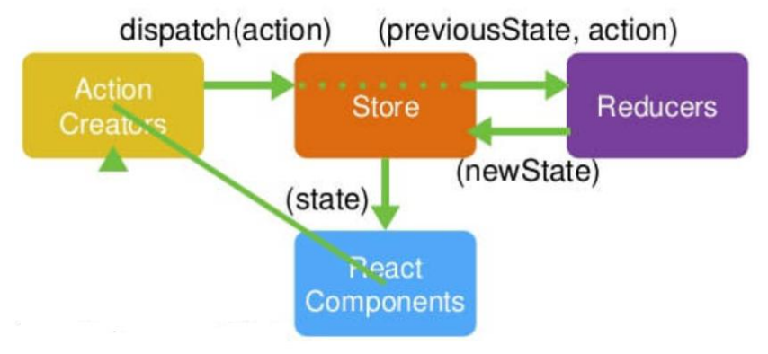

# React中使用Redux


### 什么是redux

- redux 是一个独立专门用于做状态管理的 JS 库(不是 react 插件库) 
- 它可以用在 react, angular, vue 等项目中, 但基本与 react 配合使用
- 作用: 集中式管理 react 应用中多个组件共享的状态 



- ActionCreators是创建action的工厂函数
- Store是数据仓库
- Reducers接受旧数据和action，返回新的数据
- action的格式为 `{type: 'xxx', data: 'xxx'}`


## 1.1.1基础知识

### JavaScript纯函数 

-    确定的输入，一定会产生确定的输出 
-    函数在执行过程中，不能产生副作用 （不对返回值之外的东西进行任何操作）

```js
// 它的输出是依赖我们的输入内容，并且中间没有产生任何副作用，所以这是一个纯函数
function add(a, b) {
    return a + b;
}


let foo = 6;
// 这个函数输出的值依赖于外部变量foo，当外部变量foo发生改变时，会影响输出的值
// 违反了确定的输入一定会产生确定的输出原则，不是纯函数
function add(num){
    return num + foo
}


let obj = {name: '张三', age: 18};
// 函数执行后改变了外部变量obj，产生了副作用，所以也不是纯函数
function changeName(obj){
    obj.name= '张三丰';
    return obj;
}
```


###  纯函数在函数式编程中的重要性

-    可以安心的写和安心的用 
-    保证了函数的纯度，只用实现自己的业务逻辑即可，不需要关心传入的内容或者依赖其他的外部变量 
-    确定你的输入内容不会被任意篡改，并且自己确定的输入，一定会有确定的输出 

 React中就要求我们无论是函数还是class声明一个组件，这个组件都必须像纯函数一样，保护它们的props不被修改 

在Redux中，reducer也被要求是一个纯函数。 


## 1.2为什么需要Redux

```js
1.JavaScript开发的应用程序，已经变得越来越复杂了
// JavaScript需要管理的状态越来越多，越来越复杂
// 这些状态包括服务器返回的数据、缓存数据、用户操作产生的数据等等，也包括一些UI的状态

2.管理不断变化的state是非常困难的
// 状态之间相互会存在依赖，一个状态的变化会引起另一个状态的变化，View页面也有可能会引起状态的变化
// 当应用程序复杂时，state在什么时候，因为什么原因而发生了变化，发生了怎么样的变化，会变得非常难以控制和追踪

3.React是在视图层帮助我们解决了DOM的渲染过程，但是State依然是留给我们自己来管理

4.Redux就是一个帮助我们管理State的容器：Redux是JavaScript的状态容器，提供了可预测的状态管理

5.Redux除了和React一起使用之外，它也可以和其他界面库一起来使用（比如Vue），并且它非常小（包括依赖在内，只有2kb）

// 举个例子：比如我们有一个朋友列表需要管理：
1.如果我们没有定义统一的规范来操作这段数据，那么整个数据的变化就是无法跟踪的
2.整个应用程序错综复杂，当出现bug时，很难跟踪到底哪里发生的变化
```


## 1.3Redux的核心理念

### Store

```js
// 作用: redux 库最核心的管理对象
// 它内部维护着state reducer
// 核心方法: 
// getState() 获取store中管理的数据对象
// dispatch(action) 分发一个action
// subscribe(listener)  订阅store的修改, 这个函数的返回值也是一个函数，调用返回值函数可以取消监听

store.getState()
store.dispatch({type:'INCREMENT', number})
store.subscribe(()=>{
    console.log('store发生了改变')
})
```


### action

#####  Redux要求我们通过action来更新数据 

-    所有数据的变化，必须通过派发（dispatch）action来更新 
-    action是一个普通的JavaScript对象，用来描述这次更新的type和content 
-    强制使用action的好处是可以清晰的知道数据到底发生了什么样的变化，所有的数据变化都是可跟踪、可预测的 

```js
// 1.标识要执行行为的对象

// 2.包含 2 个方面的属性 
// type: 标识属性, 值为字符串, 唯一, 必要属性 
// xxx: 数据属性, 值类型任意, 可选属性 

// 3.实例
const action = { type: 'INCREMENT', data: 2}

// 4.Action Creator(创建 Action 的工厂函数)
const increment = (number) => ({type: 'INCREMENT', data: number})
```


### reducer

-    reducer是一个纯函数 
-    reducer做的事情就是将传入的state和action结合起来生成一个新的state 

```js
// 1.根据老的 state 和 action, 产生新的 state 的纯函数

// 2.举例
export default function counter(state = 0, action) {
    switch (action.type) {
        case 'INCREMENT':
        	return state + action.data
        case 'DECREMENT':
        	return state - action.data
        default:
        	return state
    }
}

// 3.注意
// 返回一个新的状态
// 不要修改原来的状态
```


## 1.4Redux的三大原则

```js
1.单一数据源
// 整个应用程序的state被存储在一颗object tree中，并且这个object tree只存储在一个 store 中
// Redux并没有强制让我们不能创建多个Store，但是那样做并不利于数据的维护
// 单一的数据源可以让整个应用程序的state变得方便维护、追踪、修改

2.State是只读的
// 唯一修改State的方法一定是触发action，不要试图在其他地方通过任何的方式来修改State
// 这样就确保了View或网络请求都不能直接修改state，它们只能通过action来描述自己想要如何修改state
// 这样可以保证所有的修改都被集中化处理，并且按照严格的顺序来执行，所以不需要担心race condition（竟态）的问题

3.使用纯函数来执行修改
// 通过reducer将 旧state和 actions联系在一起，并且返回一个新的State
// 随着应用程序的复杂度增加，我们可以将reducer拆分成多个小的reducers，分别操作不同state tree的一部分
// 但是所有的reducer都应该是纯函数，不能产生任何的副作用
```


## 1.5Redux的使用

```js
// 安装
yarn add redux
```

```js
import {createStore} from 'redux';

// reducer
const initialState = {name: '张三', age: 20}
const reducer = (state = initialState, action)=>{
    const newState = {...state};
    switch (action.type){
        case 'INCREMENT':
            newState.age += 1;
            return newState;
        case 'DECREMENT':
            newState.age -= 1;
            return newState;
        case 'ADD_NUMBER':
            const num = action.num;
            newState.age += num;
            return newState;
        default:
            return newState
    }
}

// store
const store = createStore(reducer);

// action
const action1 = {type: 'INCREMENT'};
const action2 = {type: 'DECREMENT'};
const action3 = {type: 'ADD_NUMBER', num: 6}

// subscribe 订阅store的改变
store.subscribe(()=>{
    console.log(store.getState())
})

// 派发action， 派发action后就会去执行reducer
store.dispatch(action1);
store.dispatch(action2);
store.dispatch(action3);


```


## 1.6在React中使用Redux

```jsx
// 1.创建一个store文件夹存放redux相关文件

// 2.创建action-type.js来存放action类型常量名称
export const ADD_NUM = 'ADD_NUM';
export const SUB_NUM = 'SUB_NUM';

// 3.创建actionCreator.js，这是创建action对象的工厂函数文件
import {ADD_NUM, SUB_NUM} from './action-type'

export const AddAction = (num)=> ({type: ADD_NUM, num})
export const SubAction = (num)=> ({type: SUB_NUM, num})

// 4.创建reducer.js, 这是redux中改变数据的文件
import {ADD_NUM, SUB_NUM} from './action-type';

const initialState = {count: 0}
const reducer = (state = initialState, action)=>{
    let newState = {...state};
    switch (action.type){
        case ADD_NUM:
            newState.count += action.num;
            return newState
        case SUB_NUM:
            newState.count -= action.num;
            return newState
        default:
            return newState
    }
}

export default reducer;

// 5.创建store.js, 这是redux的数据仓库
import {createStore} from 'redux';
import reducer from "./reducer";

export default createStore(reducer);


// 6.在react项目的入口文件订阅store的改变
import React from 'react';
import ReactDOM from 'react-dom';
import App from './App';
import store from "./store/store";

const render = ()=>{
    ReactDOM.render(
        <App />,
        document.getElementById('root')
    );
}

// 初始化渲染
render();
// 订阅监听
store.subscribe(()=>{
    render();
})


// 7.在组件中使用
import React, {Component} from 'react';
import store from "./store/store";
import {AddAction, SubAction} from './store/actionsCreator'

export default class App extends Component {
    constructor(props) {
        super(props);
    }

    render() {
        return (
            <div>
                <p>count: {store.getState().count}</p>

                <p onClick={()=>{this.changeCount('add', 1)}}>Add 1</p>
                <p onClick={()=>{this.changeCount('add', 5)}}>Add 5</p>
                <p onClick={()=>{this.changeCount('add', 10)}}>Add 10</p>

                <p onClick={()=>{this.changeCount('sub', 1)}}>Sub 1</p>
                <p onClick={()=>{this.changeCount('sub', 5)}}>Sub 5</p>
                <p onClick={()=>{this.changeCount('sub', 10)}}>Sub 10</p>

            </div>
        )
    }

    changeCount = (type, num)=>{
        type === 'add' ? store.dispatch(AddAction(num)) : store.dispatch(SubAction(num))
    }

}


// 这种写法存在一个问题，代码中存在大量的重复代码： store.getState、 store.dispatch。
```


```jsx
// 想要将store里的数据和action转换为该组件的属性通过 this.props.xxx来使用
// 那就需要用到高阶组件(将组件作为参数或返回组件的函数)来包裹一下

// 创建connect.js
import React, { Component } from "react";
import store from "../store/store";

export default function connect(mapStateToProps, mapDispatchToProps) {
    return function (WrappedComponent){
        return class extends Component{
            render() {
                return (
                    <WrappedComponent
                        {...this.props}
                        {...mapStateToProps(store.getState())}
                        {...mapDispatchToProps(store.dispatch)}
                    />
                )
            }
        }
    }
}


// 重构App.js, 让app组件中不包含store.getStaet() 和 store.dispatch()
import React, {Component} from 'react';
import {AddAction, SubAction} from './store/actionsCreator'
import connect from "./utils/connect";

class App extends Component {

    render() {
        return (
            <div>
                <p>count: {this.props.count}</p>

                <p onClick={()=>{this.changeCount('add', 1)}}>Add 1</p>
                <p onClick={()=>{this.changeCount('add', 5)}}>Add 5</p>
                <p onClick={()=>{this.changeCount('add', 10)}}>Add 10</p>

                <p onClick={()=>{this.changeCount('sub', 1)}}>Sub 1</p>
                <p onClick={()=>{this.changeCount('sub', 5)}}>Sub 5</p>
                <p onClick={()=>{this.changeCount('sub', 10)}}>Sub 10</p>

            </div>
        )
    }

    changeCount = (type, num)=>{
        const {addNum, subNum} = this.props;
        type === 'add' ? addNum(num) : subNum(num)
    }
}

// 这里的state是指redux管理的数据对象，而不是组件的state
// 这里之所以是个函数而不是对象是因为不想在每一个组件中都引入store对象
const mapStateToProps = state=> ({
    count: state.count
})

const mapDispatchToProps = dispatch => ({
    addNum(num){
        dispatch(AddAction(num))
    },
    subNum(num){
        dispatch(SubAction(num))
    }
})

export default connect(mapStateToProps, mapDispatchToProps)(App)
```


## 1.7使用react-redux

```js
yarn add react-redux
```

```jsx
// 其实用react-redux和上面的代码差别不大，省略了自己去订阅store的变化和connect的封装

// 入口文件 index.js
import React from 'react';
import ReactDOM from 'react-dom';
import App from './App';
import store from "./store/store";
import {Provider} from 'react-redux';

ReactDOM.render(
    // Provider 组件其实是 订阅store的变化 和 封装了Context来传递store给connect函数 
    <Provider store={store}>
        <App />
    </Provider>,
    document.getElementById('root')
);


// App组件
import React, {Component} from 'react';
import {AddAction, SubAction} from './store/actionsCreator'
import {connect} from 'react-redux';

class App extends Component {

    render() {
        return (
            <div>
                <p>count: {this.props.count}</p>

                <p onClick={()=>{this.changeCount('add', 1)}}>Add 1</p>
                <p onClick={()=>{this.changeCount('add', 5)}}>Add 5</p>
                <p onClick={()=>{this.changeCount('add', 10)}}>Add 10</p>

                <p onClick={()=>{this.changeCount('sub', 1)}}>Sub 1</p>
                <p onClick={()=>{this.changeCount('sub', 5)}}>Sub 5</p>
                <p onClick={()=>{this.changeCount('sub', 10)}}>Sub 10</p>

            </div>
        )
    }

    changeCount = (type, num)=>{
        const {addNum, subNum} = this.props;
        type === 'add' ? addNum(num) : subNum(num)
    }
}

const mapStateToProps = state=> ({
    count: state.count
})

const mapDispatchToProps = dispatch => ({
    addNum(num){
        dispatch(AddAction(num))
    },
    subNum(num){
        dispatch(SubAction(num))
    }
})

export default connect(mapStateToProps, mapDispatchToProps)(App)


```


## 2 .1异步操作得到的数据如何处理

-    在之前简单的案例中，redux中保存的counter是一个本地定义的数据 
-    我们可以直接通过同步的操作来dispatch action，state就会被立即更新。 
-    但是真实开发中，redux中保存的很多数据可能来自服务器，我们需要进行异步的请求，再将数据保存到redux中 

我们知道，网络请求可以在class组件的componentDidMount中发送，所以我们可以有这样的结构 


也就是先发起网络请求，请求成功获得数据后，再通过dispatch action来更新数据。

但是这样做存在一个缺陷：

-    我们必须将网络请求的异步代码放到组件的生命周期中来完成；  

事实上，网络请求到的数据也属于我们状态管理的一部分，更好的一种方式应该是将其也交给redux来管理。

那么redux如何才可以进行异步操作呢？答案就是使用中间件。


## 2.2 中间件 redux-thunk

redux也引入了中间件（Middleware）的概念 ， 目的是在dispatch的action和最终达到的reducer之间，扩展一些自己的代码 。 比如日志记录、调用异步接口、添加代码调试功能等等 

我们现在要做的事情就是发送异步的网络请求，所以我们可以添加对应的中间件 ：redux-thunk

### redux-thunk是如何做到让我们可以发送异步的请求呢？ 

-    在默认情况下的dispatch(action)，action需要是一个JavaScript的对象 
-    redux-thunk可以让 action 是一个函数 
-    该函数会被调用，并且会传给这个函数一个dispatch函数和getState函数 ， dispatch函数用于我们之后再次派发action ， getState函数考虑到我们之后的一些操作需要依赖原来的状态，用于让我们可以获取之前的一些状态 


## 2.3 如何使用redux-thunk

```js
安装
yarn add redux-thunk

1.在store.js中使用中间件
import {createStore, applyMiddleware} from 'redux';
import reducer from "./reducer";
import thunk from "redux-thunk";

// 使用applyMiddleware挂载中间件 applyMiddleware(中间件1, 中间件2 ...)
const store = createStore(reducer, applyMiddleware(thunk));
export default store;

2.在actionCreator.js中新增异步action
import {ADD_NUM} from './action-type'

export const AddAction = (num)=> ({type: ADD_NUM, num})
// 新增的异步action
export const AsyncAddAction = (dispatch, getState)=>{
    setTimeout(()=>{
        // dispatch一个同步action
        dispatch(AddAction(6))
    }, 1000)
}

3.在App组件的componentDidMount中调用this.props.AsyncAddAction即可执行异步请求并更新数据
import React, {Component} from 'react';
import {AsyncAddAction} from './store/actionsCreator'
import {connect} from 'react-redux';

class App extends Component {

    componentDidMount() {
        this.props.AsyncAddAction();
    }

    render() {
        return (
            <p>count: {this.props.count}</p>
        )
    }
}

const mapStateToProps = state=> ({
    count: state.count
})

const mapDispatchToProps = dispatch => ({
    AsyncAddAction(){
        dispatch(AsyncAddAction)
    }
})

export default connect(mapStateToProps, mapDispatchToProps)(App)
```


## 2.4 合并reducer

```js
// 有时候我们需要给每一个模块独立出来处理，这个是时候就需要用到 combineReducers
// 修改reducer.js

import {combineReducers} from 'redux';
import userReducer from './user/reducer';
import singerReducer from './singer/reducer';

// combineReducers的作用是合并多个reducer
export default combineReducers({
    userReducer,
    singerReducer
})
```


## 2.5 调试redux

```js
1.安装浏览器插件  redux-devtools 

2.修改store.js文件
import {createStore, applyMiddleware} from 'redux';
import reducer from "./reducer";
import thunk from "redux-thunk";
// 调试用
import {composeWithDevTools} from 'redux-devtools-extension';

const store = createStore(reducer, composeWithDevTools(applyMiddleware(thunk)));

export default store;
```


## 3.1 为什么要是用redux-saga

使用 redux-thunk 时，action 的格式不固定，可能是对象，也可能是函数。如果是函数，执行这个函数，返回对象格式的 action，再跑 reducer 部分。这就造成了异步代码的分布很不集中。使用 redux-saga 可以解决这个问题，统一 action 格式为对象，将所有异步逻辑放到 saga generator 函数中 。


## 3.2 redux-saga的介绍

redux-saga 是一个用于管理应用程序 side effect 副作用（ 例如： 异步操作等 ）的库，它的目的是让 副作用 管理更加简单，执行更高效。

redux-saga 是 redux 的一个中间件，可以通过正常的 redux action 从主应用程序启动，暂停和取消，它可以访问完整的 redux state， 也能够 dispatch redux action。

redux-saga 使用了 Es6 的 Generator 功能，让异步流程更易读取、写入和测试。通过这种方式，让异步代码看起来更加像标准的同步 JavaScript 代码。


## 3.3 redux-saga 常用API 介绍

### createSagaMiddleware

创建一个 redux 的中间件，在 createStore 的参数中引入，

### run 

创建的这个中间件，动态运行我们指定的 saga 函数

```js
// store.js
import {createStore, applyMiddleware} from 'redux';
import reducer from "./reducer";
import saga from "./saga";
// 1.引入 createSagaMiddleware
import createSagaMiddleware from 'redux-saga';
// 2.创建中间件
const sagaMiddleware = createSagaMiddleware();
// 3.通过 applyMiddleware 传入 store 中
export default createStore(reducer, applyMiddleware(sagaMiddleware));

// 4.动态地运行saga，这个saga是一个生成器函数。注意 run 方法需要在 applyMiddleware 后执行
sagaMiddleware.run(saga);

```


## 3.4 saga的辅助函数

### takeEvery

```js
// 监听一个 action，每次dispatch这个action时都会触发监听函数的执行
import {takeEvery} from 'redux-saga/effects';
import axios from "axios";

function *saga() {
  // sync_add_count 是 被dispathc 的 action 的 type 值，监听函数记得是生成器函数，否则无法使用 yield
  yield takeEvery('sync_add_count', function *() {
    console.log('sync_add_count takeEvery')
    const res = yield axios.get('http://127.0.0.1:3600/user/getInfo');
    console.log(res)
  })
}

export default saga;
```


### takeLatest

```js
// 和上面用法一致，区别在于：我们短时间内快速diapatch一个被监听的action时，只会触发最后一次，之前的都会被取消。类似于 防抖
```


### throttle

```js
// 在规定时间内dispatch多次，先执行一次，然后等待第一次完成后执行第二次，余下的不执行。超过规定时间的重复上面的操作，类似 节流
import {throttle} from 'redux-saga/effects';
import axios from "axios";

function *saga() {
  // 第一个参数是 规定的时间，是一个毫秒数
  yield throttle(100,'sync_add_count', function *() {
    console.log('sync_add_count takeEvery')
    const res = yield axios.get('http://127.0.0.1:3600/user/getInfo');
    console.log(res)
  })
}

export default saga;

```


## 3.5 saga 的 effect 函数

```js
1.take(action.type)
// take函数可以理解为监听未来的action，它创建了一个命令对象，告诉middleware等待一个特定的action， Generator会暂停，直到一个与pattern匹配的action被发起，才会继续执行下面的语句，也就是说，take是一个阻塞的 effect

dispatch({type: 'test', data: 'hello'})
function* saga() {
   while(true) {
     // take函数的返回值是一个action对象，这里的值为 {type: 'test', data: 'hello'}
     const action = yield take('test');
     yield fork(fetchData);
   }
}


2.put(action)
// put 和 redux 的 dispatch 一样，接受一个action作为参数，执行reducer里的对应逻辑
yield put({type: 'test', data: 'hello'});

3.call(fn, ...args)
// call函数你可以把它简单的理解为就是可以调用其他函数的函数，它命令 middleware 来调用fn 函数， args为函数的参数，注意：  fn 函数可以是一个 Generator 函数，也可以是一个返回 Promise 的普通函数，call 函数也是阻塞 effect

export const delay = ms => new Promise(resolve => setTimeout(resolve, ms))

export function* removeItem() {
  try {
    // 这里call 函数就调用了 delay 函数，delay 函数为一个返回promise 的函数
    return yield call(delay, 500)
  } catch (err) {
    yield put({type: actionTypes.ERROR})
  }
}


4.fork(fn, ...args)
// fork 函数和 call 函数很像，都是用来调用其他函数的，但是fork函数是非阻塞函数，也就是说，程序执行完 yield fork(fn， args) 这一行代码后，会立即接着执行下一行代码语句，而不会等待fn函数返回结果后，在执行下面的语句

import { fork } from 'redux-saga/effects'

export default function* rootSaga() {
  // 下面的四个 Generator 函数会一次执行，不会阻塞执行
  yield fork(addItemFlow)
  yield fork(removeItemFlow)
  yield fork(toggleItemFlow)
  yield fork(modifyItem)
}


5.select(selector, ...args)
// select 函数是用来指示 middleware调用提供的选择器获取Store上的state数据，你也可以简单的把它理解为store.getState()
export function* toggleItemFlow() {
     // 通过 select effect 来获取 全局 state上的 `getTodoList` 中的 list
     let tempList = yield select(state => state.getTodoList.list)
     // 也可以直接获取redux中的所有state
     const state = yield select();
}
```


## 4.Hook 语法

react-redux 还提供了两个钩子：useSelector 和 useDispatch 

```jsx
import { useSelector, useDispatch } from 'react-redux'
import {Name} from '../../redux/actions'

const Content = () => {
  // useSelector 接受一个函数，参数为 状态管理的数据state， 返回我们想要拿到的数据
  let name = useSelector(state => state.name)
  // useDispatch 获取dispatch函数
  let dispatch = useDispatch()
  
  
  return(
    <div>
      redux 结合 hook
      显示{name}
      <div onClick={() => {dispatch({type:'NAME',preload:'my name'})}}></div>
    </div>
  )
}

export defau Content
```

