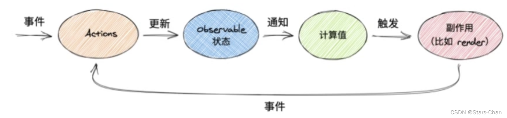
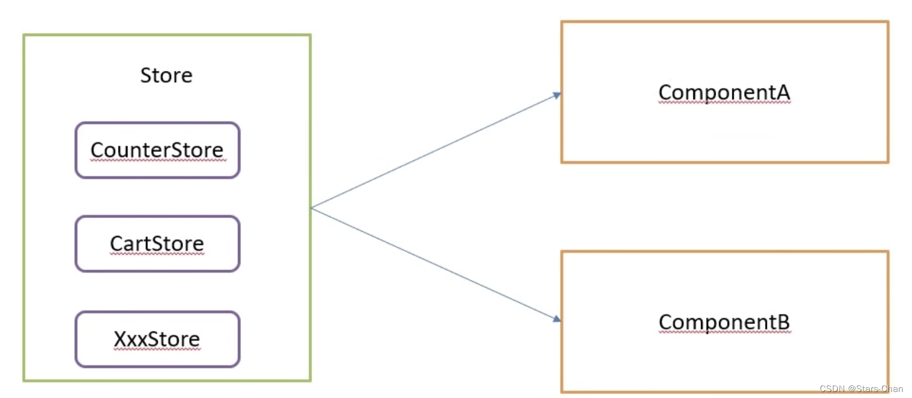

## 1.`Mobx`简介

`MobX` 是一个简单的可扩展的状态管理库，无样板代码风格简约。目前最新版本为 6，版本 4 和版本 5 已不再支持。

在 `MobX6` 中不推荐使用装饰器语法（就是带@的写法），因为它不是 ES 标准，并且标准化过程要花费很长时间，但是通过配置仍然可以启用装饰器语法。

`MobX` 可以运行在任何支持 `ES5` 的环境中，包含浏览器和 Node。`MobX` 通常和 React 配合使用，但是在 Angular 和 `Vue` 中也可以使用 `MobX`。


## 2.`Mobx`与 `Redux`的对比

|                 Mobx                  |                 Redux                  |
| :-----------------------------------: | :------------------------------------: |
|           无模板代码，简洁            | 有严格的模板代码，需要写大量的模板代码 |
| 数据是响应式的，可以直接修改（proxy） |           需要保证数据不可变           |
|         Mobx可以直接处理异步          |        Redux需要中间件处理异步         |
|     Mobx适合简单，规模不大的应用      |   Redux约束强，适合大型多人协作开发    |


## 3.依赖包安装

```js
// 安装mobx 和 mobx-react 或者 mobx-react-lite (只支持函数组件)
yarn add mobx mobx-react-lite
```


## 4.核心概念



- `observable ` ：定义一个存储state的可追踪字段（`Proxy`）
- `action` ：将一个方法标记为可以修改`state`的`action`
- `computed`：标记一个可以由`state`派生出新值并且缓存其输出的计算属性


## 5.基本使用

```jsx
1.创建可观察状态

makeObservable(target, annotations?, options?)
/* 
这个函数可以捕获已经存在的对象属性并且使得它们可观察， 一般在类的构造器函数中使用，
第一个参数是 this， 第二个参数是给属性成员添加注解 
observable：可跟踪字段
action：修改字段的方法
computed：计算属性
flow：异步
*/
               
makeAutoObservable(target, overrides?, options?)
/*
makeAutoObservable是加强版的makeObservable，在默认情况下它将推断所有属性。推断规格如下
所有属性都成为observable
所有方法都成为action
所有的个体都成为computed

overrides 用来覆盖默认注解，比如有些属性不需要可观察，可以手动改为false 
options 中使用 autoBind: true 表示主动绑定 this
makeAutoObservable(target, { count: false }, { autoBind: true })
*/
               
      
// 计数器
import { makeObservable, makeAutoObservable, observable, action, computed } from 'mobx';

class Counter{
    // 当前值
    count = 0
    constructor() {
        makeObservable(this, {
            count: observable,
            // 这里action加了 .bound 是表示主动绑定this，防止其它地方调用时导致的this指向错误
            changeCount: action.bound,
            resetCount: action,
            double: computed
        })
        
        // 推荐写法，使用 makeAutoObservable 来代替 makeObservable
        makeAutoObservable(this, {}, { autoBind: true })
    }

    // 修改count的方法
    changeCount(type = 0){
        void(type === 0 ? this.count-- : this.count++)
    }
    // 重置count的方法
    resetCount(){
        this.count = 0
    }
    // 获取count * 2的值
    get double(){
        return this.count * 2
    }
}

// 每一个store只能初始化一次，所以在这里先实例化再导出使用
const counter = new Counter();
export default counter;


2.在组件中使用mobx的数据
// observer() 是一个高阶组件，需要接收一个组件作为参数
import { observer } from 'mobx-react-lite';
import counter from "../../store/Counter";

const Home = ()=>{

	return(
		<div>
			<p onClick={()=> counter.changeCount(1)}>Home Page</p>
			<p>count: {counter.count}</p>
		</div>
	)
}

export default observer(Home);
```


## 6.监听属性

```js
/* mobx 监听属性的变化可以使用 autorun 或者 reaction
autorun函数 接受一个函数作为参数，在创建以及每当该函数所观察的值发生变化时，它都会运行；
mobx会自动收集并订阅所有可观察属性，一旦有改变发生，autorun将会再次触发

reaction类似autorun，但在初始化时不会自动运行，且可以让你更加精细地控制要跟踪的可观察对象，
其接受两个函数作为参数，第一个函数的返回值代表你要监听的可观察属性，第二个函数是一个回调函数，它的参数是监听属性的新值和旧值
*/

import { makeAutoObservable, autorun, reaction } from 'mobx';

class Counter{
    count = 0
    name = ''
    constructor() {
        makeAutoObservable(this, {}, { autoBind: true })
    }

    setName(){
        this.name = '张三'
    }
    changeCount(){
        this.count++
    }
}


const counter = new Counter();
// count 或者 name 发生改变，都会触发
autorun(()=>{
    console.log('autorun', counter.count, counter.name)
})
// 这个写法代表只监听 name 的变化，count发生变化时不会触发
reaction(()=> counter.name, (newValue, oldValue)=>{
    console.log('reaction', newValue, oldValue)
})
export default counter;
```


## 7.异步处理

在 `Mobx`中并不需要对异步进行任何处理，只需要保证 异步修改可观察数据的操作是在 `action`中完成即可。

```js
import { makeAutoObservable, runInAction } from 'mobx';

class Counter{
    count = 0
    constructor() {
        makeAutoObservable(this, {}, { autoBind: true })
    }

    changeCount(){
        this.count++
    }
    // 法1，在异步代码结束后，去调用一个action来需改属性值
    changeCountAsync1(){
        // 这种写法，修改count的值不是在action中执行的，控制台会出现警告
        setTimeout(()=>{
            this.count++
        }, 1000)
        // 正确写法，在得到异步结果后去调用另一个action来修改
        setTimeout(this.changeCount, 1000)
    }
    // 法2，在runInAction函数中修改属性值
    changeCountAsync2(){
        setTimeout(()=>{
            runInAction(()=>{
                this.count++
            })
        }, 1000)
    }
}


const counter = new Counter();
export default counter;
```


## 8. `Mobx`模块化

在项目规模变大后，不能将所有的状态放在一个 `Store`中，我们应该根据业务模块定义多个 `Store`，再定义一个根 `Store`来管理所有的 `Store`




```jsx
1.新建store/index.ts文件，导入所有store，使用useContext机制，自定义useStore hook，统一导出store
import { useContext, createContext } from 'react'
import cart from './Cart'
import counter from './Counter'

class RootStore {
  cart = cart
  counter = counter
}
const store = new RootStore()
// 如果 createContext 提供了默认值，不需要 Provider 
const Context = createContext(store)
export default function useStore(){
  return useContext(Context)
}


2.在需要的组件中导入，解构得到相应store
import { useStore } from './store';
import { observer } from 'mobx-react-lite';

const Home = ()=>{
	const { counter } = useStore()
	return(
		<div>
			<p onClick={counter.changeCount}>count + 1</p>
			<p>count: {counter.count}</p>
		</div>
	)
}

export default observer(Home);
```


