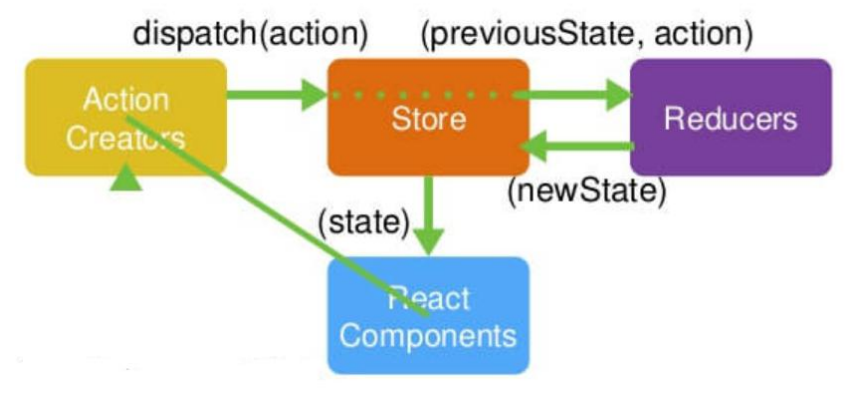

## 1.1 redux是什么

- redux 是一个独立专门用于做状态管理的 JS 库(不是 react 插件库) 
- 它可以用在 react, angular, vue 等项目中, 但基本与 react 配合使用
- 作用: 集中式管理 react 应用中多个组件共享的状态 


## 1.2 redux的工作流程




- ActionCreators是创建action的工厂函数
- Store是数据仓库
- Reducers接受旧数据和action，返回新的数据
- action的格式为 `{type: 'xxx', data: 'xxx'}`


## 1.3  什么情况下需要使用 redux 

<<<<<<< .merge_file_a01944
-   总体原则: 能不用就不用, 如果不用比较吃力才考虑使用 
-   某个组件的状态，需要共享 
-   某个状态需要在任何地方都可以拿到 
-   一个组件需要改变全局状态 
-   
-    一个组件需要改变另一个组件的状态 
=======
- 总体原则: 能不用就不用, 如果不用比较吃力才考虑使用 
- 某个组件的状态，需要共享 
- 某个状态需要在任何地方都可以拿到 
- 一个组件需要改变全局状态 
- 一个组件需要改变另一个组件的状态 


## 2.1 redux 的核心 API 

## 2.1.1  createStore() 

```js
// 作用：创建包含指定 reducer 的 store 对象
import {createStore} from 'redux' 
import reducers from './reducers' 
const store = createStore(reducers)
```


## 2.1.2   store 对象 

```js
// 作用: redux 库最核心的管理对象
// 它内部维护着state reducer
// 核心方法: 
// getState() 获取store中管理的数据对象
// dispatch(action) 分发一个action
// subscribe(listener) 

store.getState()
store.dispatch({type:'INCREMENT', number})
store.subscribe(render)


```


## 2.1.3  applyMiddleware() 

```js
// 作用：应用上基于 redux 的中间件(插件库)
import {createStore, applyMiddleware} from 'redux' 
import thunk from 'redux-thunk' // redux 异步中间件
const store = createStore(
		reducers, 
    applyMiddleware(thunk) // 应用上异步中间件
)

```


## 2.1.4   combineReducers() 

```js
// 作用：合并多个 reducer 函数
import {combineReducers} form 'redux'
export default combineReducers({
		user,
    chatUser,
    chat
})
```


## 3.1  redux 的三个核心概念 

## 3.1.1   action 

```js
// 1.标识要执行行为的对象

// 2.包含 2 个方面的属性 
// type: 标识属性, 值为字符串, 唯一, 必要属性 
// xxx: 数据属性, 值类型任意, 可选属性 

// 3.实例
const action = { type: 'INCREMENT', data: 2}

// 4.Action Creator(创建 Action 的工厂函数)
const increment = (number) => ({type: 'INCREMENT', data: number})
```


## 3.1.2  reducer 

```js
// 1.根据老的 state 和 action, 产生新的 state 的纯函数

// 2.举例
export default function counter(state = 0, action) {
    switch (action.type) {
        case 'INCREMENT':
        	return state + action.data
        case 'DECREMENT':
        	return state - action.data
        default:
        	return state
    }
}

// 3.注意
// 返回一个新的状态
// 不要修改原来的状态
```


## 3.1.3   store 

```js
// 1.将 state,action 与 reducer 联系在一起的对象

// 2.创建方法
import {createStore} from 'redux'
import reducer from './reducers' 
const store = createStore(reducer)

// 3.功能
// getState(): 得到 state
// dispatch(action): 分发 action, 触发 reducer 调用, 产生新的 state
// subscribe(listener): 注册监听, 当产生了新的 state 时, 自动调用  listener一般是组件的render函数
```


## 4.1 redux的使用示范

```shell
npm i --save redux
```


```js
// redux/action-types.js

// action 对象的 type 常量名称模块
export const INCREMENT = 'increment'
export const DECREMENT = 'decrement'

```


```js
// redux/actions.js   actionCreator 模块
import {INCREMENT, DECREMENT} from './action-types'
export const increment = number => ({type: INCREMENT, number})
export const decrement = number => ({type: DECREMENT, number})

// 异步action
export const login = (user)=>{
    const {username, password} = user;
    // 前台校验
    if(!username || !password){
        return errorMsg('用户名或密码不能为空')
    }
	// return 一个函数, 参数为 dispatch， 最后是dispath一个同步action
    return async dispatch => {
        const response = await reqLogin({username, password});
        const result = response.data;
        if(result.code === 0){
            getMsgList(dispatch, result.data._id);
            // 成功
            dispatch(authSuccess(result.data))
        }else {
            // 失败
            dispatch(errorMsg(result.msg))
        }
    }
};

```


```js
// redux/reducers.js
//根据老的 state 和指定 action, 处理返回一个新的 state

import {INCREMENT, DECREMENT} from './action-types'
export function counter(state = 0, action) {
    console.log('counter', state, action)
    switch (action.type) {
        case INCREMENT:
        	return state + action.number
        case DECREMENT:
        	return state - action.number
        default:
        	return state
    }
}

```


```react
// components/app.jsx
import React, {Component} from "react";
import {increment} from 'redux/actions.jsx';

export default class App extends Component{
    constructor(props) {
        super(props);
        this.state = {
            count: 0
        }
    }

    

    render() {
        const {count} = this.state;
        // 分发事件取修改store
        this.props.store.dispatch(increment(number))
        return(
           <p>123</p>
        )
    }
}

```


```react
// index.js
import React from 'react'
import ReactDOM from 'react-dom'
import {createStore} from 'redux'
import App from './components/app'
import {counter} from './redux/reducers'
// 根据 counter 函数创建 store 对象
const store = createStore(counter)
// 定义渲染根组件标签的函数
const render = () => {
    ReactDOM.render(
        <App store={store}/>,
        document.getElementById('root')
    )
}
// 初始化渲染
render()
// 注册(订阅)监听, 一旦状态发生改变, 自动重新渲染
store.subscribe(render)

```


单纯的使用redux有以下问题：

- redux 与 react 组件的代码耦合度太高 
- 编码不够简洁 


## 5.1  react-redux 

## 5.1.1 理解

- 一个 react 插件库 
- 专门用来简化 react 应用中使用 redux 


## 5.1.2  React-Redux 将所有组件分成两大类 

### 1） UI 组件 

- 只负责 UI 的呈现，不带有任何业务逻辑 
- 通过 props 接收数据(一般数据和函数) 
- 不使用任何 Redux 的 API 
- 一般保存在 components 文件夹下 

### 2） 容器组件 

- 负责管理数据和业务逻辑，不负责 UI 的呈现 
- 使用 Redux 的 API 
- 一般保存在 containers 文件夹下 


## 5.1.3  相关 API 

### 1 ） Provider 

```react
// 让所有组件都可以得到 store 数据
<Provider store={store}>
	<App />
</Provider>

```


### 2 ）connect() 

```react
// 用于包装 UI 组件生成容器组件
import React, {Component} from 'react';
import { connect } from 'react-redux'

// AComponent在这里为UI组件
class AComponent extents Component{
    render(){
        return(
        	<p>123</p>
        )
    }
}

connect(
    // 接受store中的state
	mapStateToprops,
    // 接受一些actionCreator
	mapDispatchToProps
)(Counter)

```


### 3） mapStateToprops ()

```react
// 将外部的数据（即 state 对象）转换为 UI 组件的标签属性
const mapStateToprops = function (state) {
    return {
    	value: state
    }
}

```


### 4)  mapDispatchToProps() 

```react
//将分发 action 的函数转换为 UI 组件的标签属性
//简洁语法可以直接指定为 actions 对象或包含多个 action 方法的对象

```


## 6.1 react-redux的使用实例

```js
// 安装依赖
npm i --save react-redux

// 有异步需求需要安装react-thunk, redux 默认是不能进行异步处理的
npm i --save redux-thunk

// 调试
npm install --save-dev redux-devtools-extension

```


redux中改变数据的文件 reducers.js

```js
// 修改全局状态的地方
import {ADD, DELETE} from "./actionsType";
import {combineReducers} from 'redux';


const initPlayList = [
    {name: '一路向北', singer: '周杰伦'},
    {name: '稻香', singer: '周杰伦'},
    {name: '好久不见', singer: '陈奕迅'},
    {name: '没那么简单', singer: '黄小琥'},
    {name: '黄昏', singer: '周传雄'},
    {name: '谁不是在流浪', singer: '大壮'}
]

// 必须是一个纯函数，不能改变传入的参数， 也就是说不能改变state，需要返回一个新的state
const playList  = (state = initPlayList, action)=> {

    switch (action.type) {
        case ADD:
            return [...state, action.data]
        case DELETE:
            let arr = [...state];
            arr.splice(action.data, 1);
            return arr
        default:
            return state
    }
}

// combineReducers的作用是合并多个reducer
export default combineReducers({
    playList
})

```

 

定义action名称的文件  actionType.js

```js
// 定义常量名
export const ADD = 'ADD';
export const DELETE = 'DELETE';

```


创建action对象的工厂函数文件  actions.js

```js
// 创建action对象的工厂函数
import {ADD, DELETE} from "./actionsType";

export function add_song(data) {
    return {type: ADD, data}
}

export function delete_song(data) {
    return {type: DELETE, data}
}

// 异步添加歌曲 redux本身不能进行一步操作，需要引入 react-thunk
// 在进行异步操作时返回一个带有 dispatch 参数的函数，在异步操作完成后，分发一个同步action
export function async_add_song(data) {
    return dispatch => {
        setTimeout(()=>{
            dispatch(add_song(data))
        }, 3 * 1000)
    }
}

```


store.js

```js
// applyMiddleware 使用中间件
import {createStore, applyMiddleware} from 'redux';
import reducers from "./reducers";
// 调试用
import {composeWithDevTools} from 'redux-devtools-extension';
// 使redux可以进行异步操作
import thunk from "redux-thunk";

const store = createStore(reducers, composeWithDevTools(applyMiddleware(thunk)));

export default store;

```


项目入口文件 index.js

```js
import React from "react";
import {render} from "react-dom";
import 'antd/dist/antd.css';
import App from "./App";
// 状态管理对象
import store from "./redux/store";
import {Provider} from 'react-redux';

render((
  	// 让所有组件都可以得到 state 数据
    <Provider store={store}>
        <App/>
    </Provider>

), document.getElementById('root'));

```


App.jsx

```jsx
import React, {Component} from 'react';
import Playlist from "./components/Playlist";
import Add from "./components/Add";

export default class App extends Component {

    render() {
        return (
            <div>
                <Playlist/>
                <Add/>
            </div>
        )
    }
}

```


PlayList.jsx

```jsx
// 播放列表
import React, {Component} from 'react';
import {Card} from "antd";
import {connect} from 'react-redux';
import {Button} from "antd";
import {delete_song} from "../redux/actions";

class Playlist extends Component {
    constructor(props) {
        super(props);
        this.state = {};
    }

    componentDidMount() {

    }

    render() {
        return (
            <Card title="play list" bordered={false} >
                {this.listView()}
            </Card>
        )
    }

    listView = ()=>{
        const {playList} = this.props;
        return (
            <ul>
                {
                    playList.map((item, index)=>{
                        return (
                            <li key={item.name} style={{
                                display: 'flex',
                                marginBottom: 10,
                                alignItems: 'center'
                            }}>
                                <div style={{width: 180}}>{item.name}</div>
                                <div style={{width: 180}}>--&nbsp;&nbsp;&nbsp;&nbsp;&nbsp;&nbsp;{item.singer}</div>
                                <Button type='danger' size='small' onClick={()=>{
                                    this.props.delete_song(index);
                                }}>删除</Button>
                            </li>
                        )
                    })
                }
            </ul>
        )
    }

}

// 使用connect({mapStateToProps, mapDispatchToProps})(UI组件)后 ，this.props中存在playList、delete_song 属性
export default connect(
    state => ({playList: state.playList}),
    {delete_song}
)(Playlist)

```


Add.jsx

```jsx
import React, {Component} from 'react';
import {Input, Button} from "antd";
import {connect} from 'react-redux';
import {add_song, async_add_song} from "../redux/actions";

class Add extends Component {
    constructor(props) {
        super(props);
        this.state = {
            name: '',
            singer: ''
        };
    }

    handleChange = (event, name)=>{
        this.setState({
            [name]: event.target.value
        })
    }

    addSong = (type)=>{
        const {name, singer} = this.state;
        if(type === 'async'){
            this.props.async_add_song({
                name,
                singer
            })
        }else {
            this.props.add_song({
                name,
                singer
            })
        }

        this.setState({
            name: '',
            singer: ''
        })

    }

    render() {
        const {name, singer} = this.state;
        return (
            <div style={{
                marginTop: 36,
                display: 'flex',
                flexDirection: 'column',
                marginLeft: 60
            }}>

                <Input style={{width: 360, marginBottom: 18}} placeholder='请输入歌曲名称' value={name} onChange={(e)=>{
                    this.handleChange(e, 'name')
                }}/>
                <Input style={{width: 360, marginBottom: 18}} placeholder='请输入歌手名称' value={singer} onChange={(e)=>{
                    this.handleChange(e, 'singer')
                }}/>
                <Button style={{width: 360, marginBottom: 18}} type='primary' onClick={()=>{
                    this.addSong('sync')
                }}>同步增加歌曲</Button>
                <Button style={{width: 360}} type='primary' onClick={()=>{
                    this.addSong('async')
                }}>异步增加歌曲</Button>
            </div>
        )
    }
}

export default connect(
    state => ({}),
    {add_song, async_add_song}
)(Add)

```
